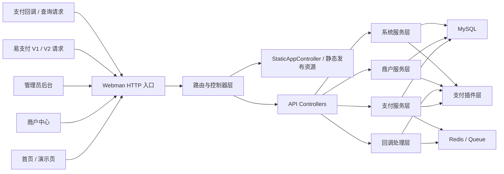
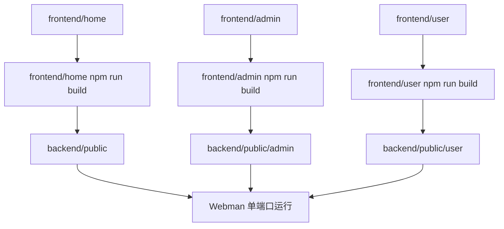
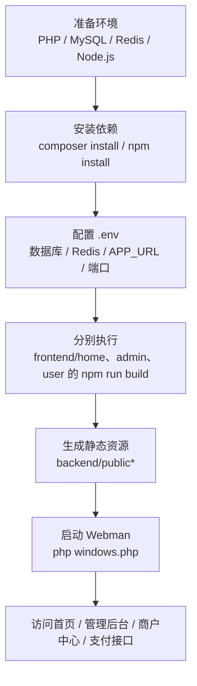

# NexPay

NexPay 是一个基于 `Webman + Vue 3` 的聚合支付系统，提供：

- 管理员后台
- 商户中心
- 首页与演示页
- 易支付 V1 / V2 兼容接口
- 插件化支付扩展能力

## 系统优势

- 单端口部署  
  首页、商户中心、管理后台、支付接口可统一由 Webman 单端口对外提供，部署链路更简单。

- 易支付兼容接入  
  同时保留 V1 / V2 兼容入口，便于对接已有商户系统与历史接入程序。

- 插件化支付架构  
  支付能力按插件组织，便于扩展不同通道、不同支付方式与差异化配置。

- 双角色后台分离  
  管理员后台与商户中心职责分开，方便平台运营、商户管理和渠道配置。

- 前后端分离但可统一发布  
  `frontend/home`、`frontend/admin`、`frontend/user` 构建后可统一发布到 `backend/public*`，兼顾开发效率与上线部署。

- 业务服务层拆分清晰  
  路由、控制器、支付服务、商户服务、系统服务、插件层分层处理，便于后续维护与扩展。

## 功能模块

- 商户管理  
  支持商户账户、商户资料、商户认证、商户通道管理与商户侧接口信息维护。

- 管理后台  
  支持平台配置、商户审核、订单查看、插件管理、日志查看与运营管理。

- 支付网关  
  提供统一支付下单、订单查询、退款、代付及兼容网关接入能力。

- 插件中心  
  通过插件扩展支付方式、验证码、短信、邮件及第三方接入能力。

- 回调处理  
  支持支付结果通知、异步回调处理、状态同步与相关日志记录。

- 单端口静态发布  
  支持首页、后台、商户中心前端构建后统一发布到后端静态目录。

## 适用场景

- 聚合支付平台搭建
- 易支付生态兼容迁移
- 多商户收款系统
- 通道中台与支付能力统一封装
- 需要后台、商户中心、兼容接口一体化部署的项目

## 架构图



### 发布结构



## 部署流程



## 接口能力总览

| 分类 | 接口/入口 | 说明 |
| --- | --- | --- |
| 首页 | `/` | 首页入口 |
| 演示 | `/demo` | 支付演示页 |
| 管理后台 | `/admin` | 管理员后台入口 |
| 商户中心 | `/user` | 商户中心入口 |
| 首页接口 | `/api/home/*` | 首页数据、演示配置等 |
| 管理接口 | `/api/admin/*` | 平台配置、商户管理、订单管理等 |
| 商户接口 | `/api/merchant/*` | 商户资料、通道、订单、资金等 |
| 易支付 V1 | `/mapi.php`、`/api.php` | V1 兼容接口 |
| 易支付 V1 页面 | `/submit.php`、`/submit2.php` | V1 页面兼容入口 |
| 易支付 V2 | `/api/pay/create`、`/api/pay/query`、`/api/pay/refund` | V2 支付能力 |
| 代付接口 | `/api/transfer/submit`、`/api/transfer/query`、`/api/transfer/balance` | 代付与余额查询 |
| 支付页 | `/pay/checkout/{trade_no}` | 统一收银与支付页 |

## 技术栈

### 后端

- PHP `8.1+`
- [Webman 2.x](https://www.workerman.net/webman)
- Think ORM
- Redis Queue
- Composer

### 前端

- Vue 3
- Vite
- TypeScript
- Element Plus
- Vue Router
- ECharts

## 运行环境要求

建议环境：

- Windows / Linux
- PHP `8.1+`
- Composer `2.x`
- Node.js `20+`
- npm `10+`
- MySQL `5.7+` / `8.0+`
- Redis `6+`

建议 PHP 扩展：

- `openssl`
- `pdo_mysql`
- `redis`
- `mbstring`
- `curl`
- `json`
- `fileinfo`

## 目录结构

```text
backend/                 Webman 后端主程序
  app/                   控制器、服务、模型、支付流程
  config/                路由、进程、数据库、会话等配置
  database/              数据库结构
  plugins/               支付及扩展插件
  public/                单端口静态发布目录
  support/               启动与基础支持代码

frontend/
  home/                  首页与演示页前端源码
  admin/                 管理员后台前端源码
  user/                  商户中心前端源码
```

## 接口入口

默认访问入口：

- 首页：`/`
- 演示：`/demo`
- 管理后台：`/admin`
- 商户中心：`/user`

后端接口分组：

- 管理后台：`/api/admin/*`
- 商户中心：`/api/merchant/*`
- 首页：`/api/home/*`

### 易支付 V1

- `POST /mapi.php`
- `POST /api.php`
- 页面兼容入口：
  - `/submit.php`
  - `/submit2.php`

### 易支付 V2

- `POST /api/pay/create`
- `POST /api/pay/query`
- `POST /api/pay/refund`
- `POST /api/pay/refundquery`
- `POST /api/pay/close`
- `POST /api/transfer/submit`
- `POST /api/transfer/query`
- `POST /api/transfer/balance`

## 安装与启动

### 1. 安装后端依赖

```powershell
cd backend
composer install
```

### 2. 配置环境变量

```powershell
Copy-Item .env.example .env
```

按实际环境修改：

- `APP_URL`
- `HTTP_PORT`
- `DB_HOST`
- `DB_PORT`
- `DB_DATABASE`
- `DB_USERNAME`
- `DB_PASSWORD`
- `REDIS_HOST`
- `REDIS_PORT`
- `TOKEN_SECRET`
- `PLATFORM_PUBLIC_KEY`
- `PLATFORM_PRIVATE_KEY`

### 3. 安装前端依赖

```powershell
cd frontend/home
npm install

cd ../admin
npm install

cd ../user
npm install
```

### 4. 启动后端

```powershell
cd backend
php windows.php
```

## 单端口部署

分别执行三个前端子项目构建：

```powershell
cd frontend/home
npm run build

cd ../admin
npm run build

cd ../user
npm run build
```

各自的 `scripts/build.mjs` 会构建：

- `frontend/home`
- `frontend/admin`
- `frontend/user`

并发布到：

- `backend/public`
- `backend/public/admin`
- `backend/public/user`

部署后启动：

```powershell
cd backend
php windows.php
```

## 说明

- 本项目包含大量插件与兼容接口，实际投产前请按所需链路完成单独验收。
- 请勿将本地密钥、运行日志、上传文件、依赖目录直接纳入公开仓库。

## 仓库

- [hzgz/NexPay](https://github.com/hzgz/NexPay)
