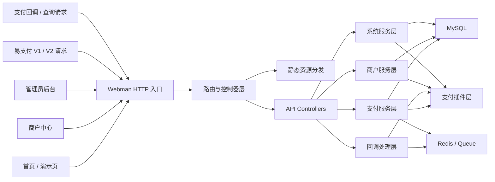

# NexPay

NexPay 是一套基于 `Webman + Vue 3 + MySQL + Redis` 的聚合支付系统，包含：

- 管理员后台
- 商户中心
- 首页与演示页
- 易支付 V1 / V2 兼容接口
- 插件化支付扩展能力

本公开仓库用于交付可部署源码，不包含运行期数据、上传文件、日志、默认管理员账号或演示商户数据。

## 系统优势

- 单入口部署  
  首页、管理后台、商户中心、兼容接口统一由 Webman 对外提供服务，部署链路更直接。

- 高并发友好  
  基于 Workerman / Webman 常驻内存模型，适合高并发、I/O 密集型支付网关场景。实际吞吐能力取决于数据库、Redis、插件实现和服务器规格。

- 低额外开销  
  前后端分离，静态资源可直接发布到 `backend/public*`，运行期组件少，便于控制资源占用。

- 易支付兼容接入  
  同时提供 V1 / V2 兼容接口，便于承接已有商户系统或历史接入程序。

- 插件化支付架构  
  支付能力按插件组织，便于扩展不同通道、不同支付方式与差异化配置。

- 管理端与商户端职责分离  
  管理后台负责平台配置、商户审核、订单和插件管理；商户中心负责通道、订单、接口信息和资金视图。

## 架构图



## 技术栈

### 后端

- PHP `8.1+`
- [Webman 2.x](https://www.workerman.net/webman)
- Think ORM
- Redis Queue
- Composer

### 前端

- Vue 3
- Vite
- TypeScript
- Element Plus
- Vue Router
- ECharts

## 环境要求

- Windows / Linux
- PHP `8.1+`
- Composer `2.x`
- Node.js `20+`
- npm `10+`
- MySQL `5.7+` / `8.0+`
- Redis `6+`

建议启用的 PHP 扩展：

- `openssl`
- `pdo_mysql`
- `redis`
- `mbstring`
- `curl`
- `json`
- `fileinfo`

## 目录说明

```text
backend/                 Webman 后端主程序
  app/                   控制器、服务、模型、支付流程
  config/                路由、进程、数据库、会话等配置
  database/              数据库结构
  plugins/               支付及扩展插件
  public/                首页静态发布目录
  public/admin/          管理后台静态发布目录
  public/user/           商户中心静态发布目录
  tools/                 运维与初始化脚本

frontend/
  home/                  首页前端源码
  admin/                 管理后台前端源码
  user/                  商户中心前端源码
```

## 快速部署

### 1. 安装后端依赖

```powershell
cd backend
composer install
```

### 2. 配置环境变量

```powershell
Copy-Item .env.example .env
```

按实际环境修改：

- `APP_NAME`
- `APP_URL`
- `HTTP_PORT`
- `DB_HOST`
- `DB_PORT`
- `DB_DATABASE`
- `DB_USERNAME`
- `DB_PASSWORD`
- `REDIS_HOST`
- `REDIS_PORT`
- `REDIS_PASSWORD`
- `TOKEN_SECRET`
- `INTERNAL_REFUND_SECRET`
- `PLATFORM_PUBLIC_KEY`
- `PLATFORM_PRIVATE_KEY`

### 3. 初始化数据库

将 `backend/database/schema.sql` 导入 MySQL。

注意：公开仓库中的 `schema.sql` 仅包含表结构和基础通道类型，不包含默认管理员、演示商户、示例密钥或运行期数据。

### 4. 创建首个管理员

```powershell
cd backend
php .\tools\create_admin.php --username=admin --password=ChangeMe123! --nickname=PlatformAdmin --email=admin@example.com
```

脚本会优先写入数据库；如果当前数据库尚不可用，则回退写入本地运行存储。

### 5. 安装前端依赖

```powershell
cd frontend/home
npm install

cd ../admin
npm install

cd ../user
npm install
```

### 6. 构建前端

```powershell
cd frontend/home
npm run build

cd ../admin
npm run build

cd ../user
npm run build
```

### 7. 发布静态资源

将构建结果复制到后端静态目录：

- `frontend/home/dist/*` -> `backend/public/`
- `frontend/admin/dist/*` -> `backend/public/admin/`
- `frontend/user/dist/*` -> `backend/public/user/`

### 8. 启动服务

```powershell
cd backend
php windows.php
```

Linux 环境可按 Webman 标准方式启动。

## 默认入口

- 首页: `/`
- 演示页: `/demo`
- 管理后台: `/admin`
- 商户中心: `/user`

## 兼容接口

### 平台接口

- `GET /api/home/*`
- `POST /api/admin/*`
- `POST /api/merchant/*`

### 易支付 V1

- `POST /mapi.php`
- `POST /api.php`
- `GET /submit.php`
- `GET /submit2.php`

### 易支付 V2

- `POST /api/pay/create`
- `POST /api/pay/query`
- `POST /api/pay/refund`
- `POST /api/pay/refundquery`
- `POST /api/pay/close`
- `POST /api/transfer/submit`
- `POST /api/transfer/query`
- `POST /api/transfer/balance`

## 安全说明

- 本仓库不提交 `.env`、运行日志、上传文件、运行期缓存和本地数据库文件。
- 本仓库不内置默认管理员密码、演示商户密钥、示例 RSA 私钥或本地开发文档。
- 支付回调、退款回调、代付回调应始终启用签名校验，生产环境不要使用兜底放行逻辑。
- 上线前请替换 `TOKEN_SECRET`、`INTERNAL_REFUND_SECRET`、平台密钥和插件私有配置。

## 许可证

后端基础框架依赖遵循各自上游许可证；项目目录内附带的 `LICENSE` 请结合实际发布策略使用。
