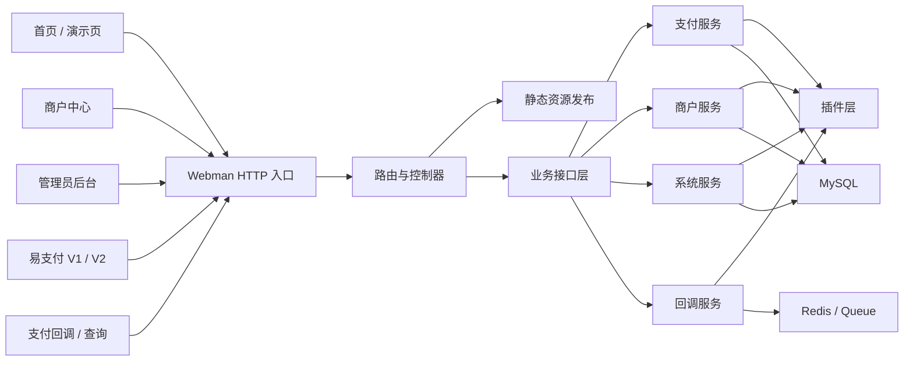

# NexPay

NexPay 是一个基于 `Webman + Vue 3` 的聚合支付系统，提供管理员后台、商户中心、首页演示页，以及兼容易支付 `V1 / V2` 的支付接口。

## 系统优势

- 低占用、单端口部署：首页、后台、商户中心、支付接口统一由 Webman 提供，部署链路简单。
- 高兼容：同时提供易支付 `V1 / V2` 接口，便于对接现有商户程序和历史系统。
- 插件化支付架构：支付通道能力按插件组织，便于扩展不同支付方式与差异化配置。
- 多角色分层：管理员后台与商户中心职责分离，方便平台运营和商户独立使用。
- 前后端分离：`frontend/home`、`frontend/admin`、`frontend/user` 分别维护，构建后统一发布到 `backend/public`。
- 服务层清晰：路由、控制器、支付服务、回调服务、商户服务、系统服务分层实现，便于继续扩展。

## 核心模块

- 管理员后台
- 商户中心
- 首页与 `/demo` 演示支付
- 易支付 V1 / V2 兼容接口
- 支付插件体系
- 订单、资金、回调、通道管理

## 架构图



## 目录说明

```text
backend/                 Webman 后端主程序
  app/                   控制器、服务、模型、支付流程
  config/                路由、进程、会话等配置
  database/              数据库结构文件
  plugins/               支付及扩展插件
  public/                首页、后台、商户中心静态发布目录
  support/               启动与基础支持代码

frontend/
  home/                  首页与 demo 前端
  admin/                 管理后台前端
  user/                  商户中心前端
```

## 技术栈

### 后端

- PHP `8.1+`
- [Webman 2.x](https://www.workerman.net/webman)
- Think ORM
- Redis Queue
- Composer

### 前端

- Vue 3
- Vite
- TypeScript
- Element Plus
- Vue Router
- ECharts

## 环境要求

- Debian / Ubuntu / CentOS / Windows
- PHP `8.1+`
- Composer `2.x`
- Node.js `20+`
- npm `10+`
- MySQL `5.7+` 或 `8.0+`
- Redis `6+`

建议开启的 PHP 扩展：

- `openssl`
- `pdo_mysql`
- `redis`
- `mbstring`
- `curl`
- `json`
- `fileinfo`

## 默认入口

- 首页：`/`
- 演示页：`/demo`
- 管理后台：`/admin`
- 商户中心：`/user`
- 支付收银台：`/pay/checkout/{trade_no}`

## 兼容接口

### 易支付 V1

- `POST /mapi.php`
- `POST /api.php`
- 页面兼容入口：
  - `/submit.php`
  - `/submit2.php`

### 易支付 V2

- `POST /api/pay/create`
- `POST /api/pay/query`
- `POST /api/pay/refund`
- `POST /api/pay/refundquery`
- `POST /api/pay/close`
- `POST /api/transfer/submit`
- `POST /api/transfer/query`
- `POST /api/transfer/balance`

## 数据库初始化

数据库结构文件位于：

- `backend/database/schema.sql`

导入后再按实际环境修改 `.env`。

## 本地开发

### 1. 安装后端依赖

```bash
cd backend
composer install
```

### 2. 配置环境变量

```bash
cp .env.example .env
```

需要重点修改：

- `APP_URL`
- `HTTP_PORT`
- `DB_HOST`
- `DB_PORT`
- `DB_DATABASE`
- `DB_USERNAME`
- `DB_PASSWORD`
- `REDIS_HOST`
- `REDIS_PORT`
- `TOKEN_SECRET`
- `PLATFORM_PUBLIC_KEY`
- `PLATFORM_PRIVATE_KEY`

### 3. 安装前端依赖

```bash
cd frontend/home && npm install
cd ../admin && npm install
cd ../user && npm install
```

### 4. 构建前端

```bash
cd frontend/home && npm run build
cd ../admin && npm run build
cd ../user && npm run build
```

构建完成后会自动同步到：

- `backend/public`
- `backend/public/admin`
- `backend/public/user`

### 5. 启动后端

```bash
cd backend
php start.php start
```

开发调试可直接前台运行，生产环境建议守护启动：

```bash
php start.php start -d
```

## Debian 生产部署建议

1. 安装 `nginx`、`php-cli`、`php-mysql`、`php-redis`、`composer`、`redis-server`、`mysql-server`
2. 克隆本仓库
3. 执行 `composer install`
4. 分别在 `frontend/home`、`frontend/admin`、`frontend/user` 执行 `npm install && npm run build`
5. 复制 `backend/.env.example` 为 `backend/.env` 并填写数据库、Redis、站点地址
6. 导入 `backend/database/schema.sql`
7. 使用 `php start.php start -d` 启动 Webman
8. 使用 Nginx 反向代理到 `HTTP_PORT`

## 性能说明

NexPay 基于 Workerman / Webman 的常驻内存模型，相比传统 PHP-FPM 页面式执行，具备更低的进程切换成本，更适合聚合支付、回调通知、订单查询这类高频 HTTP 请求场景。

但实际是否能做到低占用、高并发、高速率，仍取决于：

- 服务器 CPU / 内存配置
- MySQL 与 Redis 配置
- 插件实现质量
- 是否开启日志、队列、定时任务
- 回调链路和第三方接口耗时

建议生产环境至少使用 `2C / 2G` 及以上配置，`1G` 实例可用于轻量测试或演示环境。

## 说明

- 本项目包含较多支付插件与兼容入口，正式投产前请按实际业务链路逐项验收。
- 请勿将本地密钥、日志、上传文件、依赖目录、运行数据提交到公开仓库。

## 仓库地址

- [hzgz/NexPay](https://github.com/hzgz/NexPay)
